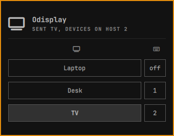

# Odisplay

Switch a monitor between USB-C, DisplayPort and HDMI from the Omarchy bar, using the MCCS
standard VCP feature `0x60` (Input Source).



## Which monitor this was built for

**Dell S2725DC**, 27-inch QHD, model number `61815`.

The three VCP values in `Panel.qml` come from that panel's EDID:

| Panel button | VCP `0x60` value | Where the value comes from |
|---|---|---|
| DisplayPort | `0x0f` (15) | Advertised in the EDID as `DisplayPort-1` |
| HDMI | `0x11` (17) | Advertised in the EDID as `HDMI-1` |
| USB-C | `0x1b` (27) | **Not in the advertised list.** Found by testing. |

Two things about that table are worth knowing before you trust it on a different panel.

`ddcutil capabilities` reports the input feature like this on an S2725DC:

```
Feature: 60 (Input Source)
   Values:
      1b: Unrecognized value
      0f: DisplayPort-1
      11: HDMI-1
```

**For another monitor**, run `ddcutil capabilities` and read the values under `Feature: 60`,
then edit the `inputs` list at the top of `Panel.qml`. Values differ between manufacturers.

## Check your monitor can do this at all

```bash
ddcutil detect
ddcutil capabilities --display 1 | grep -A6 'Feature: 60'
```

If `Feature: 60` is missing, the monitor's firmware does not expose input switching over DDC/CI
and no value will work.

## Install

This plugin is not in the Omarchy marketplace yet. Clone it and link it in:

```bash
git clone <this-repo> "$HOME/github/odisplay"

# Relative target, so the link survives a different username or home directory.
ln -sfn ../../../github/odisplay "$HOME/.config/omarchy/plugins/h1st0ry3d.odisplay"

omarchy bar put h1st0ry3d.odisplay --section right
omarchy restart shell
```

Adjust the number of `../` segments if you clone somewhere else, or replace the link with an
absolute path if you prefer.

Rename the symlink and the `id` in `manifest.json`, `moduleName` and `ipcTarget` if you fork it
under your own name.

## Use

Click the bar icon, then click an input. One tap sends the command.

Right-click the bar icon to pick which ddcutil display the commands go to (see
[The display number](#the-display-number)).

The panel shows what it sent, and whether `ddcutil` exited cleanly. That result line is session only,
and closing the panel clears it: a failure stays on screen until the next switch unless the panel
is closed, and the panel is what you close to reach the display menu, so it would sit there
indefinitely. Reopening starts on a clean line.

## Naming an input

Right-click an input instead of clicking it. The button becomes a text field holding whatever
name that input currently has. Enter saves it, Escape throws the edit away, and clicking away
counts as saving.

A name is a label and nothing else. The VCP value each button sends is still the closed list in
`Panel.qml`, so a name cannot change what a click does. Empty the field and press Enter to go
back to the built-in label.

Names are stored in `~/.local/state/odisplay/names.json`, keyed by the same `key` each input has
in the `inputs` list, so they survive a shell restart and last until you rename the input again.
That file holds the Easy-Switch channels and the picked display number as well. You can edit or
delete it by hand. The panel picks the change up straight away. A name that is not a readable
string, an Easy-Switch channel that is not `off`/`1`/`2`/`3`, or a display number outside the
menu's list is ignored, and the panel falls back to its defaults.

## Moving the keyboard and mouse with the display

The small button on the right of each row picks which Easy-Switch channel the Logitech keyboard and
mouse move to when you click that input. It reads `off`, `1`, `2` or `3`, and each click steps to
the next one. `off` leaves the devices where they are. The setting is per input and is remembered.

Hovering the button says what the value means, since the label alone is terse.

With a channel set, one click does both things, in this order:

1. `ddcutil setvcp 60 <value>` — the monitor moves.
2. `solaar config <name> change-host <n>` — once per device, keyboard first, mouse last.

**The display moves first on purpose.** If the `ddcutil` call fails the devices are left alone, so a
failed switch never leaves you looking at one machine with the keyboard and mouse attached to
another. The devices move only once the monitor has actually moved.

This needs [Solaar](https://pwr-solaar.github.io/Solaar/), which nothing else here depends on:

```bash
omarchy pkg add solaar
```

### Set the device names

Solaar matches a device by the exact name `solaar show` prints, and that name is not guessable. The
same Lift is `LIFT VERTICAL ERGONOMIC MOUSE` on one unit and `LIFT For Business` on another. Run:

```bash
solaar show
```

and put your names in the `logitechDevices` list at the top of `Panel.qml`. A name that does not
match is reported as an error in the panel rather than quietly doing nothing.

### Before you use it

- **Both sides need the channel paired first.** Software only selects a host that is already
  paired; it cannot pair a new one. Pair with the switch on the device, once.
- **The command has to run on the machine the devices are currently on.** After the switch, this
  machine loses them until the other side switches back.
- **If it goes wrong, the panel cannot fix it.** Once the mouse has moved the pointer is on the
  other machine, so you cannot click back. The switch underneath the device is the only way back.
  Test it with one device first, on a channel you have already paired.

## Before you switch to an empty input

Switching to an input with nothing plugged into it can blank the screen, and many monitors stop
answering DDC/CI once they lose the signal. When that happens these buttons cannot bring the
display back and you have to use the monitor's own controls.

A single tap sends the command, so confirm each cable carries a signal first.

## The display number

The panel runs:

```bash
ddcutil setvcp 60 <value> --display <n>
```

`n` is ddcutil's own index from `ddcutil detect`, not the connector name Hyprland uses, and it
can change between reboots. Right-click the bar icon and pick one of the four numbers: the entry
with the tick is the one in use, and the choice is stored, so it comes back after a restart.

The list is fixed rather than typed, so the number that reaches the command is always one of those
four constants. It only needs to grow if `ddcutil detect` starts printing a fifth:

```bash
ddcutil detect     # prints "Display 1 / I2C bus / DRM_connector"
```

A number that has moved is the most common failure here, so when ddcutil reports the display as
missing the panel says so and points back at this menu.

## Requirements

- **Omarchy**, with Hyprland. Tested on Hyprland 0.56.2 and Omarchy's current `qs.Ui` component
  set.
- **`ddcutil`**, at `/usr/bin/ddcutil`. Tested with 2.2.7. On Arch: `omarchy pkg add ddcutil`.
- **`solaar`**, at `/usr/bin/solaar`, only if you use the Easy-Switch buttons. On Arch:
  `omarchy pkg add solaar`. Without it the display switching still works, and the host buttons
  report that Solaar is missing instead of moving anything.
- **Write access to the monitor's I2C bus.** Omarchy's udev rules grant this to the active user
  on DDC-capable displays. Check yours with:

  ```bash
  ddcutil detect     # find your monitor, then read the I2C bus on its own Display block
  getfacl /dev/i2c-19  # does that bus list your user?
  ```

  `ddcutil detect` prints a bus for every connector it finds, including the laptop panel, so
  use the one in the same block as your monitor's model number.

  This panel runs `ddcutil` as your own user and has no privilege escalation. If the bus is not
  writable, the buttons report ddcutil's error and nothing is sent.

- A DisplayPort or HDMI connection. **VRR (FreeSync) works over DisplayPort only**, so switching
  to HDMI disables FreeSync no matter how Hyprland is configured.

## Design notes

- `ddcutil` runs as an argv array with `clearEnvironment: true` and a fixed `PATH`. No shell is
  involved, so no value is parsed twice.
- The environment also fixes `XDG_CACHE_HOME` to a folder under the state directory. Without a
  cache path, ddcutil prints two "Unable to determine dynamic sleep cache file name" lines after
  every failure that have nothing to do with the failure.
- The VCP value comes from a closed list in the source. Nothing else can reach the command.
- The display number comes from a closed list too, and a stored value that is not one of those
  numbers is ignored rather than used.
- ddcutil's output is capped at 4 KB, truncated mid-stream if it exceeds that, and the process is
  killed if it has not exited within 8 seconds.
- Output is stripped of `<`, `>` and `&` before it reaches a label the shell renders itself, and
  its line breaks become spaces so a wrapped message does not read as one run-together word.
- A failed switch says what was attempted in the panel's own words and keeps ddcutil's output
  underneath it, rather than showing an exit code on its own. ddcutil's first line is followed by
  a colon and the rest by a full stop, so a wrapped message reads as one sentence. Picking a
  display from the menu clears that failure, since the failure is what pointed at the menu.
- A custom name is display only, and is re-checked against the closed `inputs` list when it is
  read back: wrong types, unknown keys and control characters are dropped rather than shown.
- An Easy-Switch channel is checked the same way, against `off`/`1`/`2`/`3`. A stored value off
  that list is ignored rather than repaired, so the number that reaches Solaar is always one the
  button can display.
- `solaar` runs as an argv array from an absolute path, with `clearEnvironment: true` and the same
  fixed `PATH` as `ddcutil`. Its device name is a constant in the source and its channel comes out
  of the closed list, so both are settled before either becomes an argument.
- Devices move one at a time, and the sequence stops at the first failure, so the keyboard and
  mouse never end up split across two machines. The mouse goes last, so the pointer is still here
  if the keyboard move is what went wrong.
- Solaar gets 10 seconds per device and is killed after that. It is a Python program that opens
  the receiver, and a device that is asleep, or already on another host, leaves it waiting rather
  than failing.
- `names.json` is written through `FileView` with `atomicWrites`, so an interrupted write cannot
  leave a half file that parses as no names at all.
- A write waits for that file's first read. The panel starts with empty names, so saving before
  the read lands would overwrite the names on disk with nothing. A display picked from the menu
  before the read also wins over the file, so a right-click in the moment the panel opens is not
  silently undone.
- The bar glyph is `U+F26C` (`fa-tv`) in JetBrainsMono Nerd Font, and the panel's column headers
  reuse it over the input buttons and `U+F11C` over the Easy-Switch ones. Icon names in a merged
  icon font are not guessable from the codepoint: `U+F26A` looks like a "tv" but draws a
  crescent, and `U+F245` is named `mouse_pointer` but draws an arrow rather than a mouse.

## License

MIT
